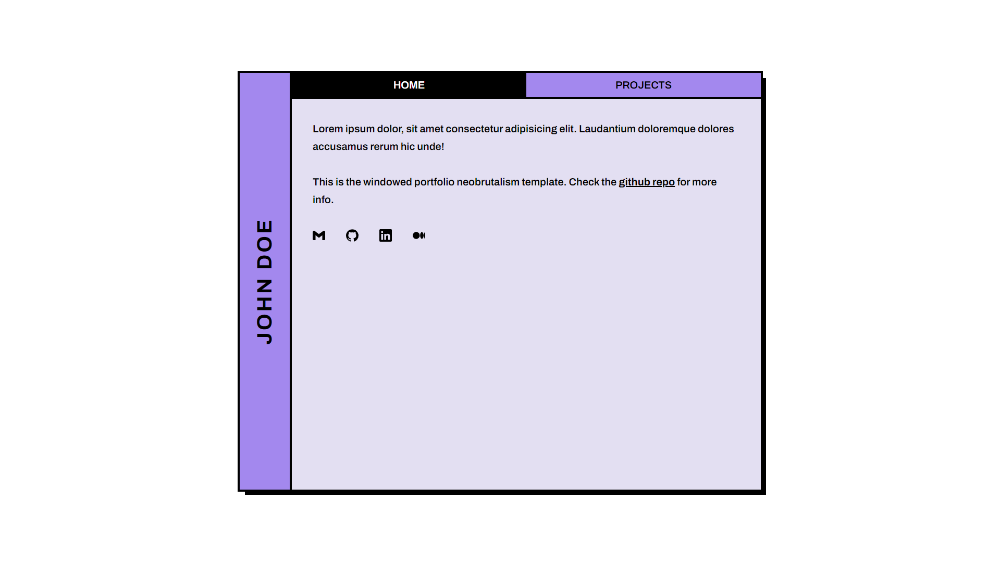

# Windowed portfolio

Windowed portfolio is a neobrutalism-styled nextjs tailwind template for portfolios.

### Installation

This new config uses `bun` package manager rather than the template's package manager which uses `pnpm`.

To install all dependencies run:

```bash
bun i
```

To run the app locally:

```bash
bun run dev
```

### Config

- Inside `layout.tsx` update the metadata
- Inside `page.tsx` update the content
- Update the `favicon.ico`

### Content config

#### Swappable Data

To update the marquee, icon tag cloud, home links, or porfolio projects go to the `src/lib/data` folder. 

### Styling


